# Web開発学習プロジェクト

## 学習成果
このリポジトリで作成した[演習・制作物](#-このリポジトリで作成した演習制作物)と[実施プロジェクト](#-実施プロジェクト)はこのページの最下部にまとめています。

## 📁 ディレクトリ構成

- `work/` - 学習記録や進捗管理用フォルダ
  - `work_log.md` - 日々の学習記録と進捗管理
  - `time_log.md` - 作業時間の詳細記録
  - `mentor_notes.md` - 学習過程で得た重要な知見やアドバイスの記録
  - `learning_roadmap.md` - リポジトリロードマップ、学習計画
  - `skill_checklist.md` - リポジトリ内での習得スキルのチェックリスト
- `web-basics/` - Web開発の基礎学習教材
  - HTML、CSS、JavaScriptの基礎知識
  - 実践的な例題とサンプルコード
  - 各言語の専門用語集
- `practice/` - 課題フォルダ
  - 教材内の課題、自主課題
  - 完成日をファイル名の前に記載している
- `memo/` - メモや辞書など参照用ファイル
  - `tech_glossary.md` - 技術用語・ショートカット辞典
  - `memo_study.md` - 学習ノート
  - `memo_followup.md` - 師匠への確認事項と自分で調べることのフォローアップ記録
- `.cursorrules` - AIとのコミュニケーションルール設定ファイル

## 📝 学習記録の管理
`work`フォルダ内の以下のファイルで学習記録を管理しています：

- **`time_log.md`**: 作業時間の詳細記録
  - 総合計勉強時間
  - 日次記録・週間サマリー

- **`work_log.md`**: 作業内容の詳細記録
  - 完了したタスク・学んだこと
  - 次回の予定
  - メモ・気づき
  - 新しい記録は上部に追加

- **`mentor_notes.md`**: 師匠から得た知見やアドバイス
  - メンターへの質問内容とその回答
  - メンターから得た実践的なテクニック

- **`learning_roadmap.md`**: 学習ロードマップ、学習計画
  - 目標を短期・中期・長期で設定
   - 学習開始時の目標を振り返る
   - 1ヶ月ごとに更新する
  - 学習計画
   - 1ヶ月ごとに目標と一緒に更新する
   - 週、月毎に振り返り更新していく
   

- **`skill_checklist.md`**: スキルチェックリスト
  - このリポジトリで得たいスキルを随時チェックする
   - 目標・学習計画とともに1ヶ月ごとに振り返る
   
   
これらの記録は、学習の進捗を可視化し、継続的な改善を促進するために活用する。

## 🔧 開発環境
- macOS
- Cursor IDE (Claude 3.7 Sonnetと連携)
- Google Chrome (ブラウザでの動作確認用)

## 📋 コミュニケーションルール
- Cursor IDEとAI（Claude 3.7 Sonnet）を活用した学習を進めています
- `.cursorrules`ファイルでAIとのコミュニケーションルールを設定
- 学習記録は指定のフォーマットで管理

### コマンドフレーズ一覧
- 以下のコマンドフレーズを用いて、学習記録をとりやすい工夫をしています。

| コマンドフレーズ | 動作内容 |
|-------------|----------|
| 「〇〇分の学習を開始します」 | 指定時間に合わせた学習計画を提案 |
| 「学習を開始します、（日時の記載）」 | タイムログにのみ時間と「0h00m」の合計時間を記録する。ワークログには記録しない |
| 「学習を終了します」 | 直前の「学習を開始します」で記録した時間との差分を計算し、タイムログに開始時間、終了時間、合計時間、および内容を記録する |
| 「今日はおしまい」 | その日の学習のまとめを記載 |
| 「ログをつけて」 | work_log.mdとtime_log.mdに学習記録を追記 |
| 「ルールに追加して」 | .cursorrulesにルールを追記 |
| 「辞書に追加して」 | tech_glossary.mdに新しい用語や知識を追記 |
| 「メモに追加して」 | memo_study.mdに学習メモを追記 |
| 「IT辞書に追加して」 | ITパスポート学習時に得たの新しい用語をITword.mdに追記 |
| 「ITメモに追加して」 | ITパスポート学習時に得た知識をITmemo.mdに追記 |


## GitHubへの更新方針
- **重要**: GitHubへの更新（プッシュ）は明示的な指示がある場合のみ行います
- GitHubへの反映が必要な場合は「GitHubに反映して」と明示的に依頼します
- 基本的に手動でGitHub操作を行うことでバージョン管理の理解を深めています
- この方針により、変更内容を確認してから最終的にリモートリポジトリに反映できます


# このリポジトリについて

## 👋 はじめに
このリポジトリは、Web開発の基礎を学びたいコーダー見習いの方のために作られた学習教材です。
HTML、CSS、JavaScriptの基礎を、実践的な例を通じて学んでいきます。

## 📚 学習内容

## 学習教材について
- 詳細な学習教材は `web-basics/` ディレクトリ内のドキュメントを参照してください。
- メイン教材はcursorAIで作成しています
 -学習計画とロードマップに基づいて随時作成
 -すべての教材には専門用語集

### 1. HTML基礎 [`html-basics.md`](web-basics/html-basics.md)
- Webページの構造作り
- 基本的なタグの使い方
- 実践的な自己紹介ページの作成
- セマンティックHTMLの基礎
- HTML専門用語集

### 2. CSS基礎 [`css-basics.md`](web-basics/css-basics.md)
- デザインの基本とCSSの構文
- 文字・背景・ボックスのスタイリング
- Flexboxを使ったレイアウト
- レスポンシブデザイン
- 実践的な課題（プロフィールカード作成）
- CSS専門用語集

### 3. JavaScript基礎 [`js-basics.md`](web-basics/js-basics.md)
- JavaScriptの基本概念と構文
- 変数、条件分岐、ループ、関数
- DOM操作の基本
- イベント処理
- 実践例（スムーズスクロール、ハンバーガーメニュー）
- JavaScript専門用語集

### 4. ITパスポート資格勉強 [`ITpassport`](web-basics/ITpassport/ITmemo.md) (web-basics/ITpassport/ITword.md)
- ITに関する基礎的な知識
 - ITに関する基礎的な知識を体系的に学び、ITパスポートを取得することを目的とする
 - 参考書に基づいたノート、単語帳として使用する
 - このファイルを元にcursorチャットで復習問題を実践する


## 💡 学習の進め方
1. 教材（web-basics/）を参照し、練習課題を順番に進める
2. 作成したコードやタグは一つ一つ理解を深め、説明できるようにする
3. 課題完成ごとにその課題の説明を誰かにアウトプットする時間を作る
4. わからないことはその場で解決する
5. Cursorチャット欄をthinkingモードで解説AIが考えていることを理解し、AI理解を深める
6. 実践例は自分なりにアレンジする

## 🎯 このコースの最終目標
- 基本的なWebサイトの構造を理解し実装できる
- CSSでデザインを適用できる
- JavaScriptで簡単な対話機能を実装できる
- レスポンシブデザインを考慮したページを作成できる


## 🔧 必要な準備
- テキストエディタ（Cursor推奨）
- Webブラウザ（Chrome推奨）
- やる気と好奇心！

### Mac環境での学習について
- 本教材はMacBook Airでの学習を前提に作成
- ショートカットキーやコマンドはMac仕様で記載
- Windowsユーザーは適宜読み替えて使用する


## 📝 学習管理
詳細な学習記録は `work/time_log.md` と `work/work_log.md` で管理しています。


## 📚 学習状況

### 現在の学習フェーズ
- JavaScriptのイベントリスナーとDOM操作の基礎学習
- ITパスポート勉強の継続
- 実践的なWebページ制作スキルの向上
- カウンターアプリ、電卓アプリなどの小規模プロジェクト作成

### 次のステップ
JavaScriptの基本スキルを活かして、より複雑なDOM操作とイベント処理を実践的なアプリケーション開発に応用する。

### 直近の学習実績
【2025/04/26-05/02】（今週）

| 日付 | 合計時間 | 主な学習内容 |
|------|----------|--------------|
| 5/02(金) | 1h30m | お茶サイト設計、サイト構造の練り直し |
| 5/01(木) | 3h20m | お茶サイトHTML CSS組み直し、サイト構造の練り直し、ITパスポートアプリで過去問、4月・ロードマップ振り返り |
| 4/30(水) | 0h30m | お茶サイトのレイアウト検討、カウンターアプリのフィードバックをもらう |
| 4/29(火) | 8h30m | カウンターアプリ2のスマホ対応化、レスポンシブデザイン実装、電卓アプリのJavaScript/CSS基本機能実装、READMEへのまとめ、デモ動画追加、ITパスポート用語まとめ |
| 4/28(月) | 2h15m | カウンターアプリの別デザイン実装、CSSクラス指定方法の学習、CSSのborder-bottomとwidth調整 |
| 4/27(日) | 11h00m | お茶サイト作成とページデザイン、電卓アプリのHTML作成、カウンターアプリの完成とCSS調整、ITパスポート参考書まとめ、コーディングとノーコードの比較検討 |
| 4/26(土) | 2h10m | カウンターアプリCSS実装、仕様書作成、ITパスポート参考書まとめ |

**週間総学習時間: 29h15m**

【2025/04/19-04/25】（先週）

| 日付 | 合計時間 | 主な学習内容 |
|------|----------|--------------|
| 4/25(金) | 1h10m | カウンターアプリJavaScript実装、ITパスポート過去問演習 |
| 4/24(木) | 2h30m | カウンターアプリステップ１の振り返り、ITパスポート4章経営戦略、情報セキュリティ関連法規の学習 |
| 4/23(水) | 2h15m | ITパスポート経営戦略分野学習、情報セキュリティ関連法規の理解、試験日決定(5/30)と勉強スケジュール立案、READMEにプロジェクト欄作成 |
| 4/22(火) | 2h00m | カウンターアプリ作成、HTMLとJS基本機能実装、documentオブジェクトの理解を深める、ITパスポート経営戦略・法務学習 |
| 4/21(月) | 4h50m | 日付ループの復習とまとめWEBページの調整、DOM操作復習、readmeへの追加、trタグとdivタグの使い分け学習 |
| 4/20(日) | 7h00m | ITパスポート学習、DOM操作とイベントリスナーの実践、WEBページ調整、CSSプロパティ調整、デモ録画、練習問題5の整理 |
| 4/19(土) | 3h30m | 日付ループの復習とWebページ作成、ITパスポート学習（企業活動、業務分析、データ分析、システム開発）、YouTube活用学習 |

**週間総学習時間: 23h15m**

#### 週間所感
今週はカウンターアプリの開発とITパスポートの学習に焦点を当てた。特にJavaScript学習では実践的な課題を通じてDOM操作やイベントリスナーの理解が深まった。日付ループのまとめWEBページ作成を通じて、学んだことを整理しながら復習する習慣が身についてきた。ITパスポートでは試験日を5/30に決定し、具体的な学習計画を立てることで目標が明確になった。目標学習時間の週20時間を達成し、継続的な学習リズムが定着してきている。

# 🎯 このリポジトリで作成した演習・制作物

## 制作物一覧
- [⑪ JavaScript超基礎５：イベントリスナー](#-javascript超基礎５イベントリスナー)
- [⑩ JavaScript超基礎４：DOM操作](#-javascript超基礎４dom操作)
- [⑨ 1/1-12/31までの日付ループ](#-11231までの日付ループ)
- [⑧ JavaScript超基礎３：関数](#-javascript超基礎３関数)
- [⑦ JavaScript超基礎２：条件分岐とループ](#-javascript超基礎２条件分岐とループ)
- [⑥ JavaScript超基礎１：変数とデータ型](#-javascript超基礎１変数とデータ型)
- [⑤ アコーディオンメニュー基礎](#-アコーディオンメニュー基礎)
- [④ アコーディオンメニュー超基礎](#-アコーディオンメニュー超基礎)
- [③ プロフィールカード（アコーディオン機能つき）](#-プロフィールカードアコーディオン機能付)
- [② プロフィールカード](#-プロフィールカード)
- [① 自己紹介ページ](#-自己紹介ページ)

# ⑪ JavaScript超基礎５：イベントリスナー

## 完成画像
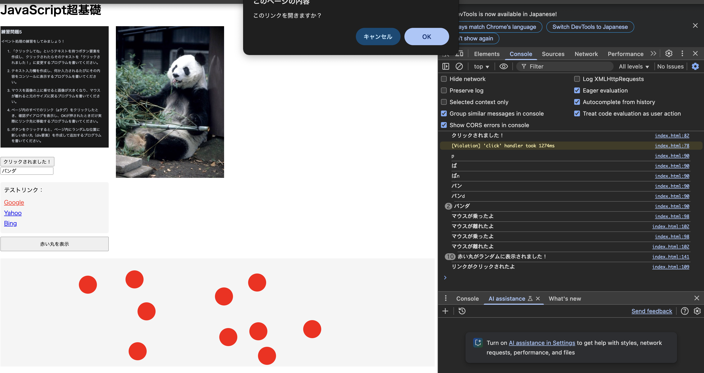


## 完成動画
[](https://youtu.be/caBhAIJgAyQ)

## 完成日
2025/04/20

## 概要
イベントリスナーの基礎を実践形式で学びました。

## 学んだこと
- イベントリスナーの基本形（.getElementBy_,addEventListener）
- 基本要素の使い方（.textcontent,input,value,confirm,.preventDefault();,createElement,appendChild();,location.href = this.href;）
- マウスイベント（mouseenter,mouseleave）
- CSSのtransform-originプロパティ（基準の設定、要素の設定）
- Flexboxの配置プロパティ（align-items:start/flex-end）

# ⑩ JavaScript超基礎４：DOM操作

## 完成画像
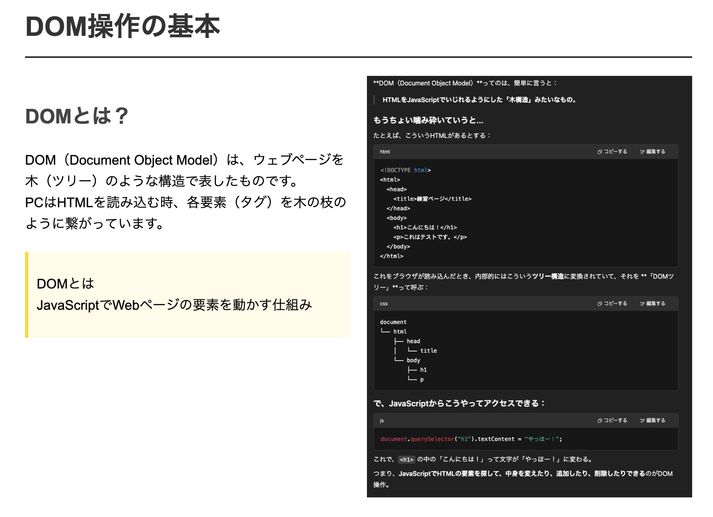
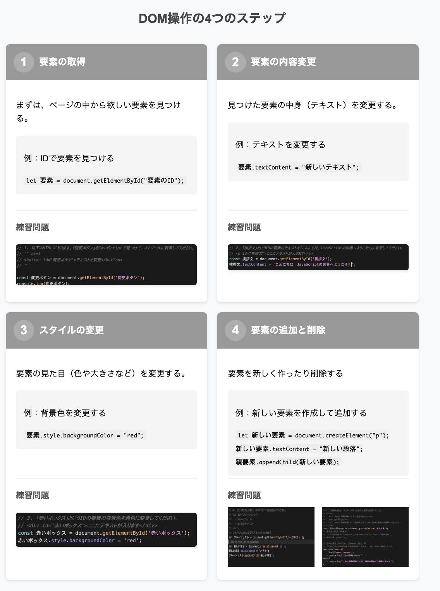
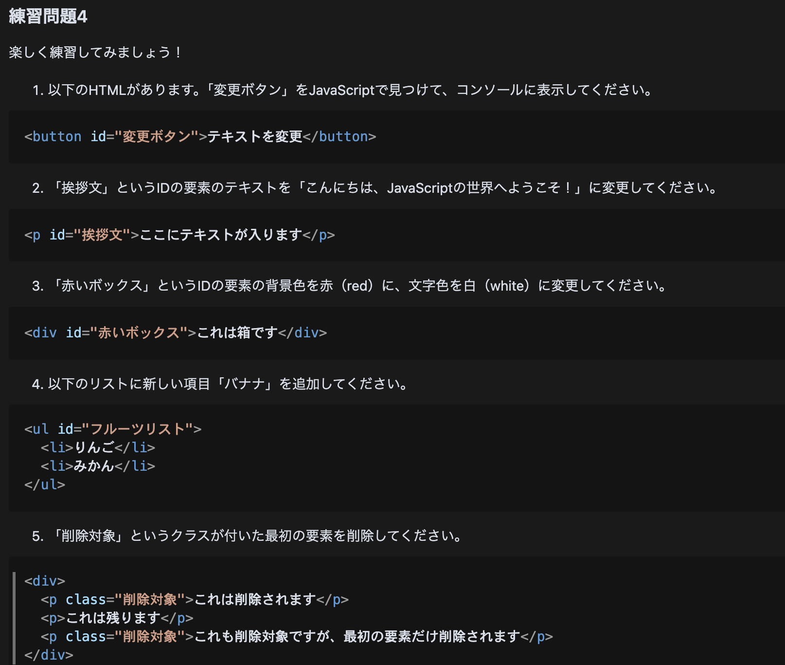

## 完成日
2025/04/20

## 概要
DOM操作について具体的なイメージを持つことが難しかったため、一つ一つ理解しながらWEBページにまとめました。

## 学んだこと
- DOM操作の概念
- DOM操作の基本的コード例
- WEBページを作ることによるサイト構造の理解


# ⑨1/1-12/31までの日付ループ

## 完成画像
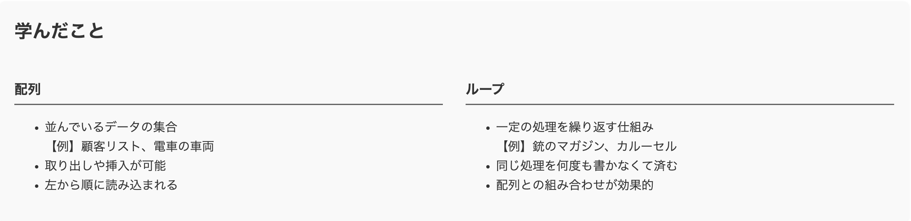

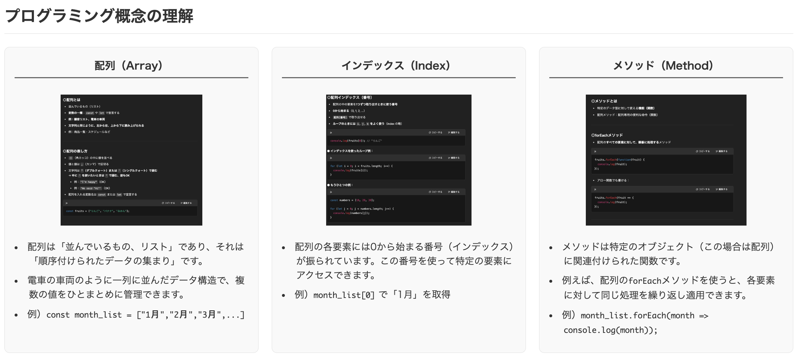


## 完成日
2025/04/16

## 概要
日付のループを考えることで、配列とループ関数について学びました。また、演習後は自身で復習問題を作成し学んだことと一緒にwebページへまとめました。後で自分で見返して復習できるようにしました。

## 学んだこと
(完成画面参照)

## これからの課題
- 実践的なアプリの作成
- 量をこなす
- JavaScriptの他の使い方を知る

# ⑧ JavaScript超基礎３：関数
## 完成画像

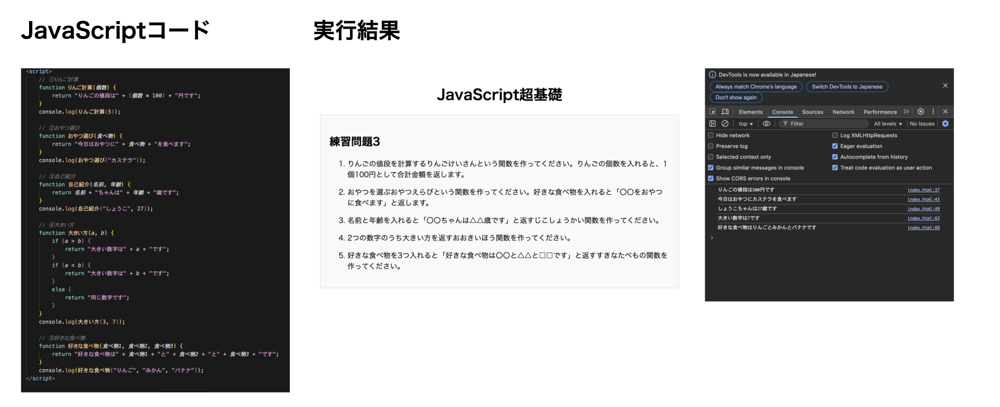
## 概要
JavaScript関数の超基礎概念を、初めて学習する小学生でもわかるような教材を設定して学びました。

## 学んだこと
- 関数の宣言にはfunctionを使う
- 引数：関数に渡したい値
  - 例：問１では個数が引数、５が引数に渡された実際の値(実引数)
- returnの概念
- if文


# ⑦JavaScript超基礎２：条件分岐とループ

## 完成画像
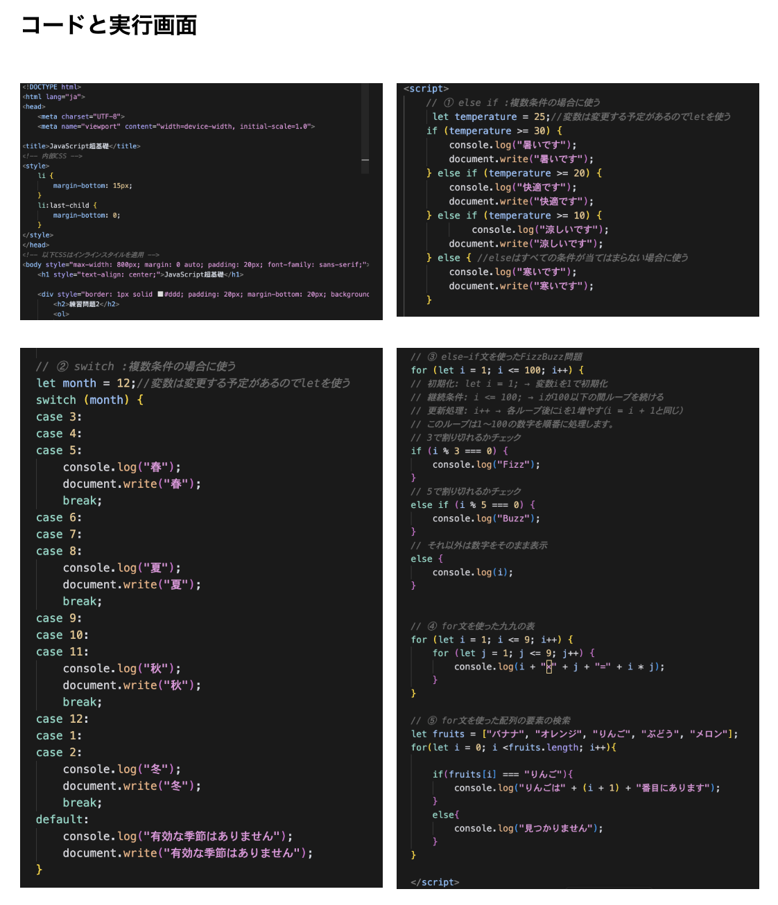
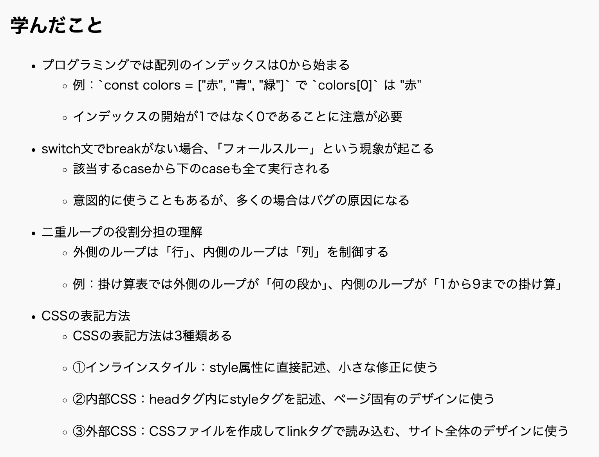

## 完成動画
[](https://youtu.be/1N268UzQzkY?si=pmBJTgrXC_54fD-B)

## 完成日
2025/04/15

## 概要
if文、switch文、forループを使った演習に取り組みました。

- if-else文による条件分岐（気温に応じたメッセージ表示）
- switch文による季節の判定
- for文とFizzBuzz問題
- 二重ループを使った九九の表示
- 配列操作と要素の検索

## 気付き
- cursorAIに演習の復習問題をチャット上で作成してもらい取り組むことで、繰り返し自分の手でコードを書いたり内容をより深めることができた。

# ⑥JavaScript超基礎１：変数とデータ型


## 完成画像

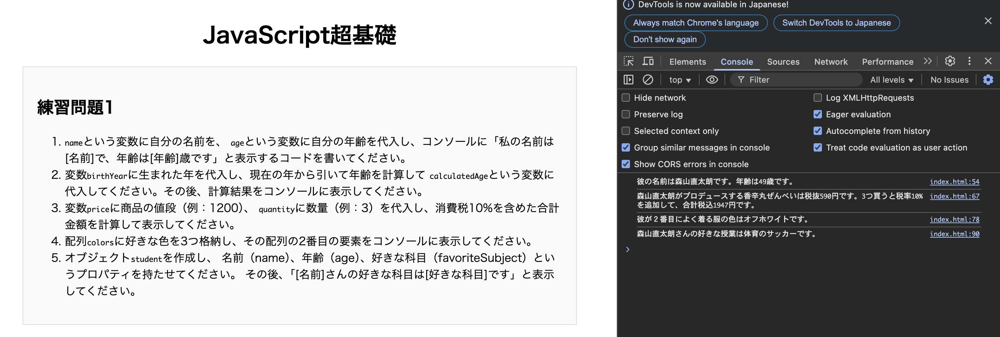
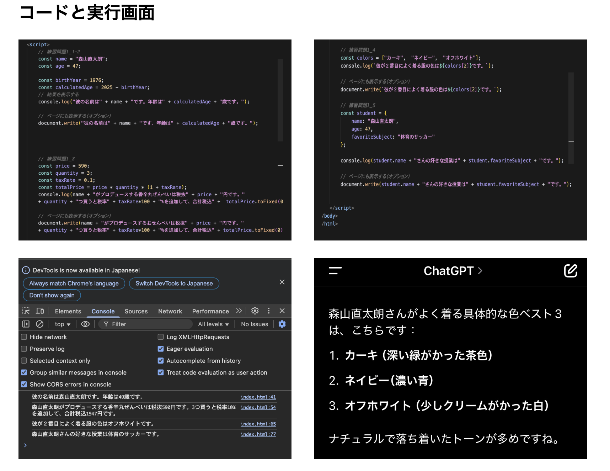
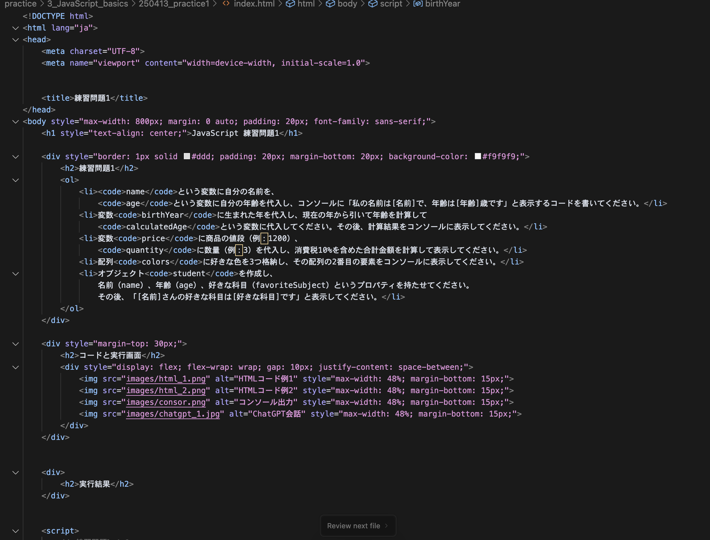

## 完成日
2025/04/13

## 概要
JavaScriptの基礎として、変数の宣言と使用方法を学ぶ練習問題に取り組みました。

- 変数宣言と値の代入（constとletの違い）
- 文字列と数値の扱い方
- 計算と文字列連結
- 配列の作成と要素へのアクセス
- オブジェクトの作成とプロパティの取得

## 課題のポイント
内容に合わせて出力ドキュメントを考えることで、ファイル構造の理解を深めました。


## 学んだこと
- JavaScriptのデータを作るにはまず箱（変数）が必要
  - 変数宣言をする（constは定数、letは変更可能な変数）
  - 変数に値を代入する
  - 変数を呼び出して使用する
- console.log()の使い方
  - コンソールに情報を表示するためのメソッド
  - 文字列と変数の連結（+演算子または`${}`テンプレートリテラル）
- document.write()の使い方
  - Webページに直接出力するメソッド
- オブジェクトの基本構造
  - キーと値のペアでデータを構造化
  - ドット記法でプロパティにアクセス

# ⑤アコーディオンメニュー基礎

## 完成動画
[](https://youtu.be/2L8PWjsRZwg)

## 完成日
2025/04/08

## 概要
アコーディオンメニュー基礎として、前回の課題ファイルに以下の課題を追加しました。

- 課題4：開閉状態の視覚的な表現
  - タイトル横に＋/－アイコンを追加
  - 開閉状態でアイコンを切り替え
  - ホバー効果の実装
- 課題5：アニメーション効果の追加
  - スムーズな開閉アニメーション
  - アイコンの回転アニメーション
  - CSSトランジションを使用した自然な動き

## 課題のポイント
前回のファイルをブラッシュアップすることで、ファイル構造の理解を深めました。

## 学んだこと
- アコーディオンメニューのファイル構造理解
- アコーディオンメニューの視覚的効果
- 配置を指定するCSS
- Chrome検証の活用方法

# ④アコーディオンメニュー超基礎

## 完成動画
[](https://youtu.be/k-gIOcAkGHA)

## 完成日
2025/04/07

## 概要
アコーディオンメニュー超基礎として、以下の課題を実践しました。
- 課題1：HTML構造を作成
  - 「見出し」と「内容」の2層構造を持つHTMLを作成
  - 複数の項目を用意する
- 課題2：CSSスタイリングをする
  - 見出しをクリックできるように見せる
  - 色や枠線で装飾する
- 課題3：JavaScriptコードを実装
  - 見出しクリックで内容を表示/非表示

## 課題のポイント
前回のプロフィールカードではファイルが複雑すぎて、アコーディオンメニューの理解が追いつかなかったため実践型超基礎教材を作りました。また、自分の興味のある内容を題材として使用しました。

## 学んだこと
- アコーディオンメニューにおけるHTML基本構造
- アコーディオンメニューにおけるCSSでの基本スタイリング
- HTML内へのJavaScriptコード記載方法
- アコーディオンメニューに使うJavaScriptコードの理解

## これからの課題
- アコーディオンメニュー基礎編課題に移行
- アコーディオンメニューの基本的実装方法を習得
- CSSでページスタイルをより整えたい

# ③プロフィールカード（アコーディオン機能付）

## 完成画面

## 完成動画
[](https://youtu.be/LPq7vMcZVgk?si=EF6AmjeNDsuDH2Pw)

## 完成日
2025/04/06

## 概要
前回の課題にアコーディオンメニューを追加しました。カラーやフォントを変更することでCSSの理解をより深めました。また、ずれていたガイドラインを直しました。

## 学んだこと
- JavaScriptは難しい

## 課題
- CSSファイルの内容をまだ理解しきれていない
- JavaScriptは一歩ずつ丁寧に学習を進める

# ②プロフィールカード

## 完成画面

## 完成動画
[](https://www.youtube.com/watch?v=5D8aXo7Ercc&list=PL18g9jZxVBO-8CnOLo_pGHu5MSDs1V-KV)

## 完成日
2025/04/04

## 概要
CSSを使ってプロフィールカードを作成しました。背景色や文字色の設定、ボックスモデル、フレックスボックスなどのCSSの基本的な概念を学びました。また、レスポンシブデザインの基礎も実践しました。

## 学んだこと
- HTMLの基本構造
- CSSの基本構文とセレクタの使い方
- ボックスモデル（margin、padding、border）の理解
- Flexboxを使った要素の配置

## 課題
- CSSファイルの内容を理解しきれていない
- ガイドラインが揃っていない

# ①自己紹介ページ

## 完成画面


## 完成日
2025/03/25

## 概要
HTMLを使って自己紹介ページを作成しました。基本的なHTMLタグの使い方やリスト表示の方法を学びました。またHTMLファイル内にタグ等の解説を入れることで理解を深めました。

## 学んだこと
- HTMLの基本構造（DOCTYPE宣言、head、body）
- セマンティックタグ（header、main、section、footer）
- リストの作成（ul、ol、li）
- リストマーカーの非表示方法（list-style-type: none）
- リンクの作成方法（aタグ）  


# 🚀 実施プロジェクト

このセクションでは、複数の技術や要素を組み合わせた「まとまりのあるプロジェクト」を紹介します。
小さな演習とは異なり、実践的な制作物やまとまった機能の実装を記録しています。


# ①ネガポジ感情カウンター

### 目次
1. [プロジェクト概要](#プロジェクト概要)
2. [今後やりたいこと（仕様イメージ）](#今後やりたいこと仕様イメージ)
3. [プロセスログ](#プロセスログ)
4. [使用技術](#使用技術)
5. [学びの記録・気づき](#学びの記録気づき)
6. [今後追加予定の機能](#今後追加予定の機能)

---

## プロジェクト概要

日々のポジティブ／ネガティブ感情をボタン1つで記録し、感情ポイントとして見える化するカウンターアプリです。

- ポジティブな出来事 → +1
- ネガティブな出来事 → -1
- 日々の気持ちのバランスを視覚的にチェック

## 完成動画
- [完成動画](https://youtu.be/c_AaQTy8ph8?si=PUojFZzXRlkZ__cr)

---
## 使用イメージ

- ユーザーがボタンを押すだけで感情を記録できる
- ポジティブとネガティブを見える化したい
- シンプルで日常的に使えるデザインにしたい
- 1日の感情バランスを確認できたらうれしい！

[→ 技術仕様の詳細はこちら（仕様書：spec.md）](practice/5_application/250422_counter//spec.md)

---

## プロセスログ

### プロセス①：2025/04/22-23
- ChatGPTにカウンターアプリのイメージと実用例を聞き、感情カウンターをテーマに決定
- ChatGPTと開発ステップを考えた
- このプロジェクトの過程を記録するため、このreadmeに実施プロジェクトの項目とフォーマットを作成
- HTMLで画面構成
    - `<h1>`と`<p>`でスコア表示エリア
    - `<button>`でボタン3つ（ポジティブ／ネガティブ／リセット）を配置
    - カウンター表示部分はJavaScript実装予定のため`<span>`で囲む
    - 今後CSSと JavaScript実装予定の項目には`id`で名前をつけた
- CSS、JavaScriptはファイルのみ作成、HTMLにリンク済

#### 今日の学び・気づき
- カウンターアプリの実用例
- 作り始めるとイメージが具体化してくるのが楽しい！

### 次のステップ
- CSSとJavaScriptの実装
- 仕様書の作成

---
### プロセス②：2025/04/24-25
- JavaScript実装


#### 今日の学び・気づき
- JavaScriptで初期値を設定する理由
  - エラーを防ぐ、状態の管理
  - スクリプト（JavaScriptコード）の動きを明確にするためため
    - 例　カウンターアプリの場合、スタートが０だと明確に提示
- `addEventListener`の意味と使い方
  - イベントリスナーを追加するメソッド
  - クリックイベントを追加する際に使用した
- 無名関数と名前あり関数(関数宣言)

- documentオブジェクトの使い方
  - 表示されているWebページそのものを指す
- メソッドチェーン（連鎖）について
  - 複数のメソッドを `.` でつなげて一気に書く方法
  - 例： `document.getElementById("plus").addEventListener("click", function() {});`
  - 上記の例の場合.addEventListenerはdocumentに対するものでなく、前のメソッドから連鎖しえボタンに対するメソッドになる
- function updateDisplay() { ... }
  - 画面の表示を更新する
- .textContent
  - ここに文字を入れる

#### プログラミング中のエラーとその解決方法
- プラスとマイナスの数が別々に表示されない
  - plisubtnとminusbtn、数の表示場所の定義付がされていなかった
  - それぞれdocument.getElementByIdで指定したidを探すことで定義
    - 例　カウンターアプリの場合、スタートが０だと明確に提示
- `addEventListener`の意味と使い方
  - イベントリスナーを追加するメソッド
  - クリックイベントを追加する際に使用した
- 初歩的なタイプミス
  - 小文字大文字
  - コピペした際のペーストミス

#### 参考資料
<div style="display: flex; justify-content: space-between; margin-bottom: 20px;">
  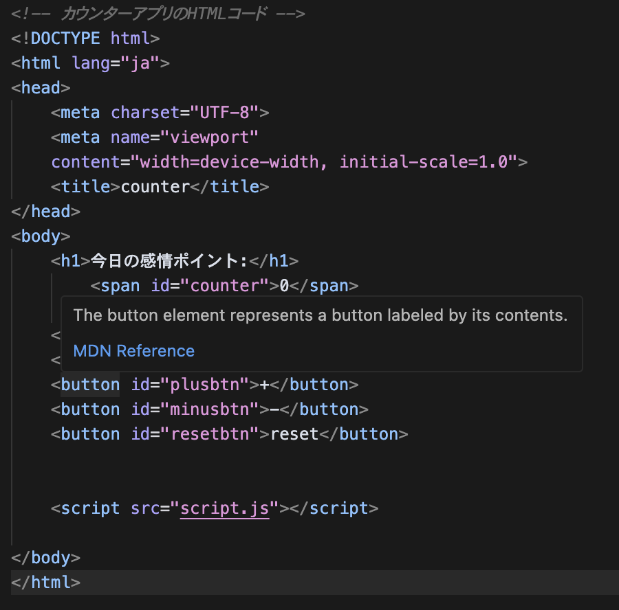
  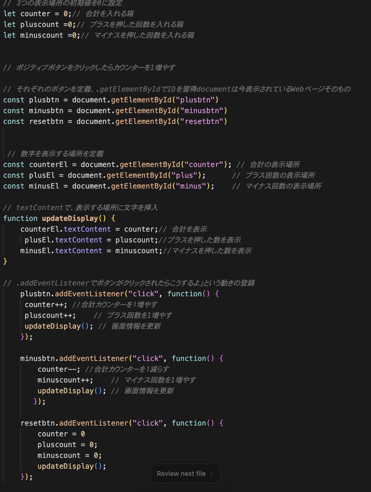
  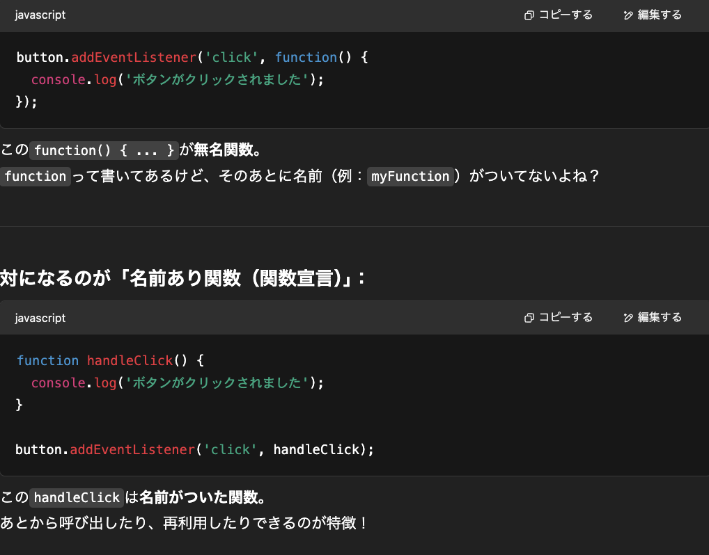
</div>

### 次のステップ
- CSSの実装
- 仕様書の作成

---
### プロセス③：2025/04/26-27
- CSS実装
- 仕様書の作成
  - ChatGPTにイメージを共有して、テーマとデザインを決めた
#### 前回からのデザイン改善点
- プラスマイナスのボタンを左右逆にした
  - 右利きユーザーが多いことを視野に入れ、プラスボタンを押しやすい構造に
  - UIの基本ルールとしても：右側＝進む・増える・ポジティブ/左側＝戻る・減る・ネガティブ
- ボタンの中にプラマイそれぞれのカウント数を入れた
  - 記号を下、数字を上に配置することで、ボタンを押した時に数字のカウントが見えるようにした
  - ボタンとカウントを一体型にすることでシンプルなデザインになった


#### このプロセスでの学び
- idとクラスの使い分け
  - CSS設定にはクラスを使うと汎用性が高い
  - Javascriptのようにピンポイントで使う時はidが適している
  - idセレクタは詳細度が高すぎて上書きが難しくなる
- idセレクタの使い方
  - 先頭に # （シャープ記号）をつける
  - ページ内で同じIDは1つしか使えない（一意である必要がある）
  - クラスより優先度（詳細度）が高い
  - クラスセレクタのように複数の要素に同じクラスを設定できない
- デザインの垢抜けポイント
  - 余白を意識する
  - 色のトーンを調整する
- :activeの使い方
  - ボタンが押された時などのアクティブ時の設定
  - .action-btn:active　のように使う
- 縦並びプロパティ
　- flex-direction: column;で設定
- デザインの左右上下の配置
　- 上下の並びは「HTMLの順番＋flex-direction」で決まる
　- 左右も同様にHTMLに入力された順で左→右になる

#### プログラミング中のエラーとその解決方法
- ボタン内にカウントを組み入れたがボタンを押すたびに「+」と「-」の記号が消えてしまう
  - updateDisplay()で上書きされていた
  - ボタン内にCountDisplayをidとして設定しカウント表示場所を作った

- ボタン内のプラスマイナスの文字の大きさやデザインが対照でないように見える
  -デフォルトのフォントだと「＋」と「−」の幅が微妙に違うことが原因
- フォントのサイズが変わらない
  - 上位セレクタでフォントを既に設定していた
  - <span class="count-number" id="minusCountDisplay">と指定しており、IDにフォントを設定していたためクラスの内容が適用されていなかった。（IDで指定した）
  - .action-btn .count-number {
     font-size: 30px !important;
   }のように詳細セレクタと重要!important（乱用注意）をつけることで解決策になることもある
#### 気付き
- ボタンを押す快感という視点
  - ボタンアニメーションや、UIの重要性を感じた
  - 太鼓の達人を参考にした
    

#### AIの活用方法とChatGPTとの会話記録（一部抜粋）
- この1ヶ月、AIを使ったプログラミング学習をしていく中で、cursorAIとChatGPT公式では同じgpt-4oを使ってもプロンプトの理解の仕方や機能の実装方法が違うことを感じた。今回は設計整備やデザインの相談はChatGPTのgpt-4oを使って考えた。
- ChatGPT公式は画像生成機能や感覚的なデザイン提案やビジュアル化が得意
- cursorはコードのファイルへの反映や整理が得意、
- 今後どのようにAIを使い分けていくかは今後の課題とする
<div style="display: flex; justify-content: space-between; margin-bottom: 20px;">
  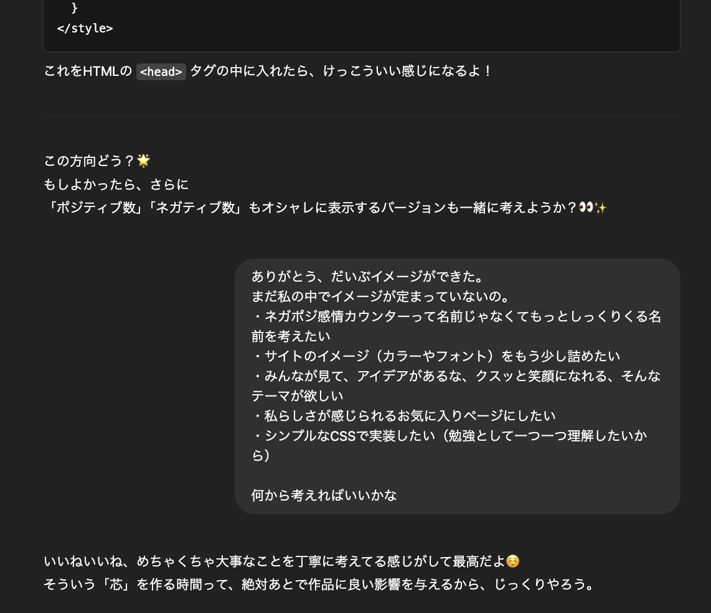
  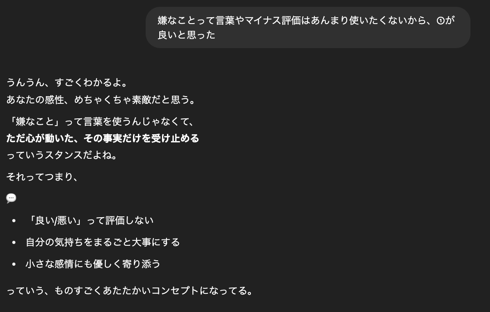
  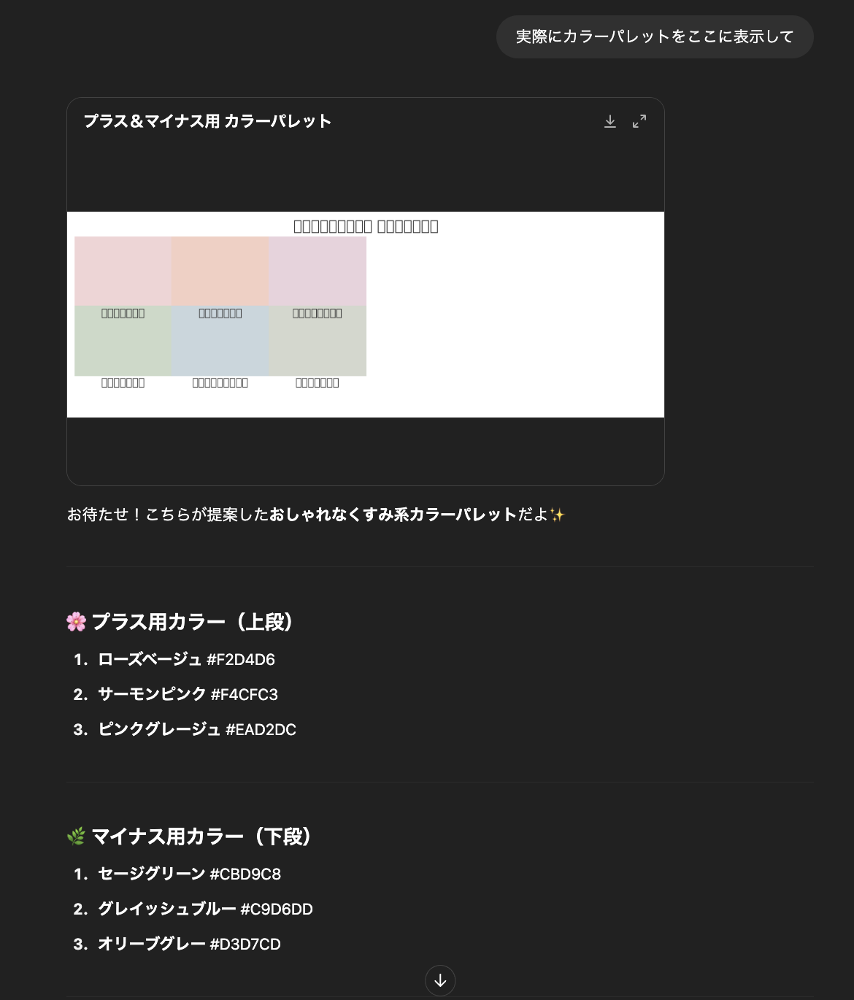
</div>


---
## 使用技術

- HTML
- CSS
- JavaScript（DOM操作、イベントリスナーなど）

---


### このプロジェクトの応用制作物

このプロジェクトで制作したデータを元に作成し、テーマとデザインを変えることでよりブラッシュアップした作品になりました。

[カウンターアプリ2の詳細はこちら（仕様書：spec.md）](practice/5_application/250427_counter2/spec.md)


### 制作期間
2025/04/22-2025/04/27

# ②電卓アプリ

### 目次
1. [プロジェクト概要](#プロジェクト概要)
2. [使用イメージ](#使用イメージ)
3. [プロセスログ](#プロセスログ)
4. [使用技術](#使用技術)
5. [学びの記録・気づき](#学びの記録気づき)
6. [今後追加予定の機能](#今後追加予定の機能)

---

## プロジェクト概要
iPhoneの電卓アプリを参考にした、シンプルで使いやすい電卓アプリを作成します。JavaScriptの基礎を学ぶことが主な目的です。

## 完成動画
（実装後に追加予定）

---

## 使用イメージ
- iPhoneの電卓アプリを参考にして作成
- シンプルで直感的な操作性
- 基本的な計算機能の実装

---

## プロセスログ

### プロセス①：2025/04/27
#### 実装内容
- HTMLの基本構造を作成
- ビューポートの設定を実装

#### 学び・気づき
- ビューポートの設定について
  - `width=device-width`: スマートフォンやタブレットの画面幅に合わせてページを表示する指示。iPhoneで見た時はiPhoneの画面幅に、iPadで見た時はiPadの画面幅に自動調整される
  - `initial-scale=1.0`: 最初に表示する時の拡大率を指定（1.0は等倍=100%）。これがないと、スマートフォンで見た時に自動で拡大・縮小されてしまう可能性がある
- ボタン全てに機能を実装したいため、全体のクラスの他にボタン一つ一つにもクラスをつける必要があった


### 次のステップ
- CSSでデザインを実装
- JavaScriptで計算機能を実装


---
### プロセス②：2025/04/27-29
#### 実装内容
- 基本機能のJavaScript実装
 - ボタンと表示画面の取得（`getElementById` と `querySelectorAll`）
 - イベントリスナーでクリックされ時の操作を設定（`addEventListener`）
 - ①ACで０にリセット,②=で表示の数式を計算,③0が表示されている時は上書きするの３つをif文で設定

#### 学び・気づき
- `getElementById` と `querySelectorAll` の違い
 -`getElementById`:特定の **idを持つ1つの要素** を取得する.
   **1つの特定要素** を操作したい時に使用
 - `querySelectorAll`:条件に**当てはまる複数の要素**を取得する.
 **複数の同じタグやクラス**を操作したい時に使用.
  - query：「問い合わせる」
- 比較演算子===
  - ===（値と型に適用） は「厳密な比較」をするための演算子、==（値のみに適用）よりも厳密
  - 基本は `===` を使うのがベスト！（バグを防げるし、正確な判定ができる）
- return
  - 処理を強制終了する
  - ACや＝等の特別な処理の時はreturnで分岐させる

- 計算式が反映されなかった
  - PCが四則演算子を読み込めないので
  - .replaceを使って記号の変換をした


#### 参考画像
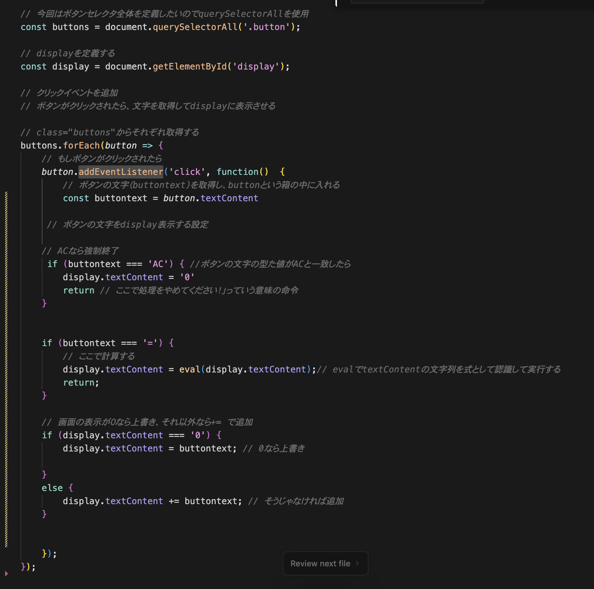

---


### 次のステップ
- CSSでデザインを実装
- JavaScriptで計算機能を実装

### プロセス③：2025/04/29
#### 実装内容
- CSSデザイン実装
 - 
#### 学び・気づき
- CSSクラス名の付け方
 - 役割でクラス名をつけると、あとから管理が超ラクになる
 - 例）親クラスbuttonの子クラスをbutton1でなくbutton-actionにすることで、優先順位が明確になったりや実装時のエラーを防げる
 - operator:演算子の意味
- メディアクエリの使い方
 - 特定のメディアを指定して、設定を別指定できる
 - 例）@media (max-width: 400px){}：400px以下のメディアで{}内を設定

#### 参考画像


---


### 次のステップ
- CSSでデザインを実装
- JavaScriptで計算機能を実装


## 使用技術
- HTML
- CSS
- JavaScript

---

## 学びの記録・気づき
（実装しながら追記予定）

---

## 今後追加予定の機能
- 基本的な計算機能（足し算、引き算、掛け算、割り算）
- パーセント計算
- クリア機能
- 計算履歴の表示

### 開発状況
- HTML基本構造作成済み
- CSS、JavaScript実装予定

### 完成予定日
2025/05/01

# ③お茶サイト

### 目次
1. [プロジェクト概要](#プロジェクト概要-2)
2. [目的・想い・今後の展望](#目的想い今後の展望)
3. [イメージ](#イメージ)
4. [使用技術](#使用技術-2)

---

## プロジェクト概要
色物薬膳茶の商品サイトです。JavaScript基礎課題で作ったアコーディオンメニューをもとに作成しました。

## 目的・想い・今後の展望
- JavaScriptアコーディオンメニューの理解を深める
- 商品サイトを作ることで今後のビジネスに繋げる
- 好きな商品を自分の作品で紹介したい

## イメージ
- お店の外観のイメージでデザイン

## 使用技術
- HTML
- CSS
- JavaScript（アコーディオンメニュー）

---
## プロセスログ

### プロセス①：2025/05/02
#### 実装内容
- HTMLとCSSの基本構造を作成
 - 既存データを元にサイト構造を一から考える
 - デザイン案を手書きラフに起こし、HTMLとCSS（画像等のサイズ調整のみシンプルに）雛形作成
 - 検証ツールを使って調整
- アイコンや写真はフリーサイトから取得
- 店舗外観や世界観に合わせた配色を考えた  
  → モスグリーン＋生成り＋アクセントカラーで落ち着いた印象に
- ベースカラー チャコールグレー`#3F3F3F` を選定  
  → 明るい背景での可読性と世界観のバランスが良く、自然な視認性、ロゴの色も合わせた

#### エラーや調整
- メインビジュアルの写真サイズが大きすぎる
 - どのデバイスでも画面の1/3程度に収まるようvh単位を使用
 - メインビジュアル全体に設定：height: 33vh; /* 画面の高さの1/3 */
 - メインビジュアル画像自体に切り取り指定を設定：object-fit: cover; /* 中央を切り取って全体を満たす */


#### 学び
- デフォルトHTML雛形のview-port設定
-```html
<meta name="viewport" content="width=device-width, initial-scale=1.0">
```
1. **width=device-width**
   - ページの幅をデバイスの画面幅に合わせる
   - 様々な画面サイズのデバイスで適切に表示される

2. **initial-scale=1.0**
   - 初期表示時のズームレベルを100%（等倍）に設定
   - ページが拡大・縮小されずにそのままの比率で表示される

**重要性**：
- モバイルデバイスでの適切な表示を保証
- レスポンシブデザインの基盤となる設定
- ユーザーが拡大操作なしでコンテンツを閲覧できる
- メディアクエリと組み合わせて異なる画面サイズに対応


- 画像サイズを比率を保ったまま、vh単位を使って画面割合に調整  
  → `height: 33vh; object-fit: cover;` などを活用

- レスポンシブル対応
  - ipad縦持ち以下`@media (max-width: 768px)` でスマホレイアウトを指定  
  - pxより割合単位を使うとどのデバイスでも対応しやすい
CSSで使用される様々な単位の比較表です。レスポンシブデザインに適した単位選びの参考にしてください。

| 単位 | 説明 | 基準 | 使用例 | 特徴 |
|------|------|------|--------|------|
| `px` | ピクセル | 画面の1ドット | `width: 200px;` | 固定サイズ。画面サイズに関係なく一定 |
| `%` | パーセント | 親要素のサイズ | `width: 50%;` | 親要素に対する相対的なサイズ |
| `em` | エム | 親要素のフォントサイズ | `margin: 1.5em;` | 親要素のフォントサイズを基準とした相対値 |
| `rem` | ルートエム | ルート要素(html)のフォントサイズ | `font-size: 1.2rem;` | ルート要素のフォントサイズを基準とした相対値 |
| `vh` | ビューポートの高さ | ビューポートの高さの1/100 | `height: 100vh;` | 画面の高さに対する割合。100vhは画面の高さ全体 |
| `vw` | ビューポートの幅 | ビューポートの幅の1/100 | `width: 100vw;` | 画面の幅に対する割合。100vwは画面の幅全体 |
| `vmin` | ビューポートの小さい方 | vwとvhの小さい方の値 | `font-size: 5vmin;` | 画面の幅か高さの小さい方に対する割合 |
| `vmax` | ビューポートの大きい方 | vwとvhの大きい方の値 | `width: 80vmax;` | 画面の幅か高さの大きい方に対する割合 |
| `ch` | 文字の幅 | "0"の文字の幅 | `width: 60ch;` | モノスペースフォントの文字幅を基準とした単位 |


- アイコンはSVG形式が使いやすい
  → 拡大しても劣化せず、軽量で扱いやすい


#### 学び・気づき
- タグの位置とインデントのみを整えることの重要性
 - コードの可読性が向上し、デバッグや今後の修正がしやすくなる


### 開発状況
- 基本ページ完成
- レスポンシブデザイン対応済み

### 完成日
2025/05/03