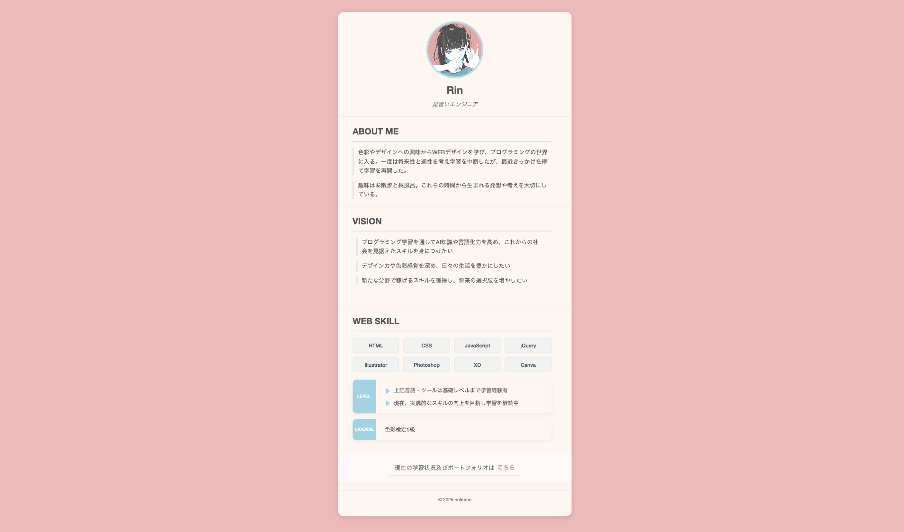

# Web開発学習プロジェクト

## 📁 ディレクトリ構成

- `work/` - 学習記録や進捗管理用フォルダ
  - `work_log.md` - 日々の学習記録と進捗管理
  - `time_log.md` - 作業時間の詳細記録
  - `mentor_notes.md` - 学習過程で得た重要な知見やアドバイスの記録
- `web-basics/` - Web開発の基礎学習教材
  - HTML、CSS、JavaScriptの基礎知識
  - 実践的な例題とサンプルコード
  - 各言語の専門用語集
- `exercises/` - 課題フォルダ
  - `profile/` - 自己紹介ページ課題
- `practice/` - 課題フォルダ
  - `profile/` - 自己紹介ページ課題
  - `2503331/` - プロフィールカード課題
- `memo/` - メモや辞書など参照用ファイル
  - `tech_glossary.md` - 技術用語・ショートカット辞典
  - `memo_study.md` - 学習メモ
  - `memo_followup.md` - 師匠への確認事項と自分で調べることのフォローアップ記録
- `.cursorrules` - AIとのコミュニケーションルール設定ファイル

## 📝 作業ログについて
`work`フォルダ内の以下のファイルで学習記録を管理しています：

- **`time_log.md`**: 作業時間の詳細記録
  - 総合計勉強時間
  - 日次記録・週間サマリー

- **`work_log.md`**: 作業内容の詳細記録
  - 完了したタスク・学んだこと
  - 次回の予定
  - メモ・気づき
  - ※新しい記録は上部に追加

- **`mentor_notes.md`**: 師匠から得た知見やアドバイス
  - 師匠への質問内容とその回答
  - 師匠から得た実践的なテクニック

これらの記録は、学習の進捗を可視化し、継続的な改善を促進するために活用します。

## 🗂 学習教材
詳細な学習内容は `web-basics/` ディレクトリ内のドキュメントを参照してください。
すべての教材には専門用語集が付いており、初心者でも理解しやすい構成になっています。

## 🔧 開発環境
- macOS
- Cursor IDE (Claude 3.7 Sonnetと連携)
- Google Chrome (ブラウザでの動作確認用)

## 📋 コミュニケーションルール
- Cursor IDEとAI（Claude 3.7 Sonnet）を活用した学習を進めています
- `.cursorrules`ファイルでAIとのコミュニケーションルールを設定
- 学習記録は指定のフォーマットで管理

### コマンドフレーズ一覧
| コマンドフレーズ | 動作内容 |
|----------------|----------|
| 「〇〇分の学習を開始します」 | 指定時間に合わせた学習計画を提案 |
| 「学習を開始します、（日時の記載）」 | タイムログに時間のみ記録する |
| 「今日はおしまい」 | その日の学習のまとめを記載 |
| 「ログをつけて」 | work_log.mdとtime_log.mdに学習記録を追記 |
| 「ルールに追加して」 | .cursorrulesにルールを追記 |
| 「師匠メモに追加して」 | mentor_notes.mdに学びや気づきを記録 |
| 「辞書に追加して」 | tech_glossary.mdに新しい用語や知識を追記 |
| 「メモに追加して」 | memo_study.mdに学習メモを追記 |
| 「確認メモに追加して」 | memo_followup.mdに「師匠へ確認してもらうこと」として記録 |
| 「調査メモに追加して」 | memo_followup.mdに「自分で調べること」として記録 |

## GitHubへの更新方針

- **重要**: GitHubへの更新（プッシュ）は明示的な指示がある場合のみ行います
- GitHubへの反映が必要な場合は「GitHubに反映して」と明示的に依頼します
- 基本的に手動でGitHub操作を行うことでバージョン管理の理解を深めています
- この方針により、変更内容を確認してから最終的にリモートリポジトリに反映できます

# 🌟 コーダー見習いのためのWeb開発入門

## 👋 はじめに
このリポジトリは、Web開発の基礎を学びたいコーダー見習いの方のために作られた学習教材です。
HTML、CSS、JavaScriptの基礎を、実践的な例を通じて学んでいきます。

## 📚 学習内容

### 1. HTML基礎 [`html-basics.md`](web-basics/html-basics.md)
- Webページの構造作り
- 基本的なタグの使い方
- 実践的な自己紹介ページの作成
- セマンティックHTMLの基礎
- HTML専門用語集

### 2. CSS基礎 [`css-basics.md`](web-basics/css-basics.md)
- デザインの基本とCSSの構文
- 文字・背景・ボックスのスタイリング
- Flexboxを使ったレイアウト
- レスポンシブデザイン
- 実践的な課題（プロフィールカード作成）
- CSS専門用語集

### 3. JavaScript基礎 [`js-basics.md`](web-basics/js-basics.md)
- JavaScriptの基本概念と構文
- 変数、条件分岐、ループ、関数
- DOM操作の基本
- イベント処理
- 実践例（スムーズスクロール、ハンバーガーメニュー）
- JavaScript専門用語集

## 💡 学習の進め方
1. 教材（web-basics/）を参照し、練習課題を順番に進める
2. 作成したコードやタグは一つ一つ理解を深め、説明できるようにする
3. 課題完成ごとにその課題の説明を誰かにアウトプットする時間を作る
4. わからないことはその場で解決する
5. Cursorチャット欄をthinkingモードで解説AIが考えていることを理解し、AI理解を深める
6. 学んだ内容を自己紹介ページに応用していく

## 🎯 このコースの最終目標
- 基本的なWebサイトの構造を理解し実装できる
- CSSでデザインを適用できる
- JavaScriptで簡単な対話機能を実装できる
- レスポンシブデザインを考慮したページを作成できる
- 学んだ内容を活かした自己紹介ページを完成させる

## 📝 注意点
- コードをコピー&ペーストするだけでなく、必ず理解しながら進めましょう
- 実践例は自分なりにアレンジしてみましょう
- エラーが出ても慌てずに、エラーメッセージを読んで対処しましょう

## 🔧 必要な準備
- テキストエディタ（Cursor推奨）
- Webブラウザ（Chrome推奨）
- やる気と好奇心！

### Mac環境での学習について
- 本教材はMacBook Airでの学習を前提に作成
- ショートカットキーやコマンドはMac仕様で記載
- Windowsユーザーは適宜読み替えて使用してください

頑張りましょう！💪✨

## 📝 学習管理
詳細な学習記録は `work/time_log.md` と `work/work_log.md` で管理しています。

## 📚 学習状況

### 現在の学習フェーズ
- プロフィールカード①②の完成
- GitHubへの成果物アップロードとREADME更新
- YouTube動画制作とREADMEへの埋め込み

### 次のステップ
JavaScript基礎学習を進め、特にアコーディオン機能の実装方法を深く理解する。

### 直近の学習実績
【2025/04/05-04/11】（今週）

| 日付 | 合計時間 | 主な学習内容 |
|------|----------|--------------|
| 4/06(日) | 2h10m | 成果物をREADMEにアップロード、YouTube動画作成とリンク追加、課題まとめ |
| 4/05(土) | 6h30m | アコーディオン部分のCSS解読、CSSガイドラインの整列問題解決、デザインカラーの統一 |

**週間総学習時間: 8h40m**

#### 週間所感
（週末に記載予定）

# 🎯 このリポジトリで作成した制作物
# ①自己紹介ページ

## 完成画面

## 概要
HTMLを使って自己紹介ページを作成しました。基本的なHTMLタグの使い方やリスト表示の方法を学びました。またHTMLファイル内にタグ等の解説を入れることで理解を深めました。

## 学んだこと
- HTMLの基本構造（DOCTYPE宣言、head、body）
- セマンティックタグ（header、main、section、footer）
- リストの作成（ul、ol、li）
- リストマーカーの非表示方法（list-style-type: none）
- リンクの作成方法（aタグ）  

# ②プロフィールカード

## 完成画面

## 完成動画

## 概要
CSSを使ってプロフィールカードを作成しました。背景色や文字色の設定、ボックスモデル、フレックスボックスなどのCSSの基本的な概念を学びました。また、レスポンシブデザインの基礎も実践しました。

## 学んだこと
- HTMLの基本構造
- CSSの基本構文とセレクタの使い方
- ボックスモデル（margin、padding、border）の理解
- Flexboxを使った要素の配置

## 課題
- CSSファイルの内容を理解しきれていない
- ガイドラインが揃っていない

# ③プロフィールカード（アコーディオン機能つき）

## 完成画面

## 完成動画

## 概要
前回の課題にアコーディオンメニューを追加しました。カラーやフォントを変更することでCSSの理解をより深めました。また、ずれていたガイドラインを直しました。

## 学んだこと
- JavaScriptは難しい

## 課題
- CSSファイルの内容をまだ理解しきれていない
- JavaScriptは一歩ずつ丁寧に学習を進める

