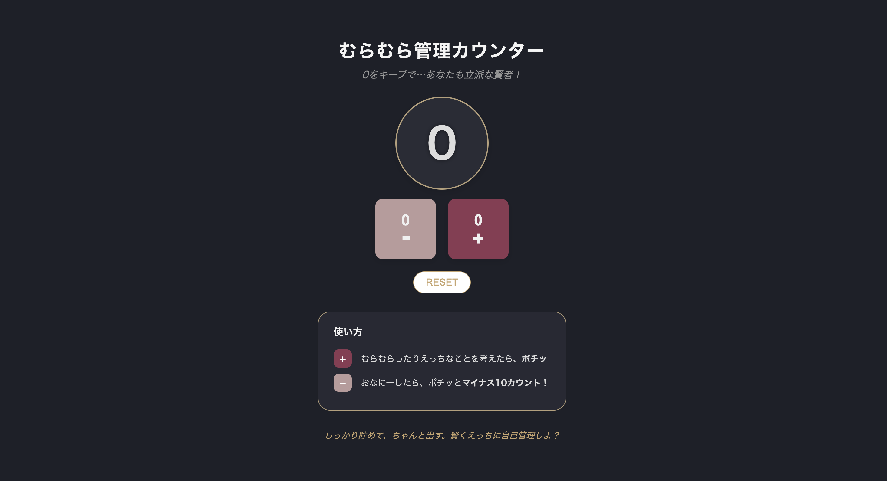

# むらむら管理カウンター 仕様書

## 概要

　日々の「むらむら」をカウントし、自己管理するためのツール。  
心の揺らぎを数値化し、自己コントロール力を高めることを目的とする。  
　エロ要素を含みながらも、大人っぽく落ち着いた世界観を意識したデザインにしている。

---

## 制作の目的

- JavaScript超基礎教材の課題プロジェクト「カウンターアプリ」で作成した制作物の応用
  - デザインとテーマを変更した作品に応用することで、JavaScriptのコード理解とサイト構造のより深い理解をしていく
- ChatGPTとの対話によるデザイン設計の実現
  - 自身の考えを効率良く整理するツールとして、最後まで完成させること（思い悩んで挫折しない）を目的に使用
- AI使用方法の模索
  - 主にgpt-4oを使用（ChatGPT公式）
  - AIはデザイン設計の相談とコード添削や新たに学ぶ事項のまとめ目的にのみ使い、プログラミングや修正等は、検証ツールを用いて基本的に自分自身で行う

---

## コンセプト
- 遊び心とエロの融合
- エロコンテンツの一般的イメージ（黒・白・金）を参考にしつつ、「いやらしさよりも遊び心」「女性が制作したことによる可愛さとエロさ」を大切にする

---

### 🎨 デザイン設計

- **背景色**：ナイトネイビー（落ち着き・大人っぽさ・おしゃれ）
- **プラスボタン**：ボルドー系（高揚感を演出・重厚感）
- **マイナスボタン**：くすみピンク系（リセット・沈静感）
- **アクセントカラー**：抵えめゴールド（貯めるイメージ・お金）

---

### 🧬 UI/UX設計の工夫
- 直感的に押したくなる配色と、操作感の気持ち良さを重視視
- 「ポイントを貯める」「自己管理する」という感覚を可視化

- **右利き配慮のプラスボタン配置**
  - 右手親指で押しやすいよう、プラスボタンを右側に配置
  - マイナスボタンは左側に設置し、直感的操作性を向上させた

- **ボタン押下時のアクティブアニメーション**
  - ボタンを押すと、色を1トーン深くしつつ、`transform: scale(0.95)`で押し込まれるような感覚を演出

- **カウント数字のポップアニメーション**
  - 数字が増減するたびに、倍等されて点滅する（`scale(1.3)`）。
  - ボタンを押下時の快感を意識した

---

### 🎨 CSS設計・レイアウト調整

- **パーツ単位のスタイル分割**
  - タイトル、カウンター、ボタン、説明エリアをクラス単位で明確に分割
  - 特定部分の調整をしやすくした

- **スマホ対応（iPhone立て持ち）レスポンシブ対応**
  - 600px以下の届き幅で、カウンター、ボタンサイズを自然に縮小
  - スマホでも無理なく一画面に継がるレイアウトになるよう設計

- **自然な下線調整（h2タグのblock化）**
  - 説明セクションのタイトルは`border-bottom`の特性を配慮し`h2` を`display: block`化
  - 文字の幅に合わせた自然な下線を実現

- **細かな配置・余白設計**
  - 検証ツールを使用して調整
  - タイトル下のキャプション，ボタン間のgap，説明エリアの余白の検証を重ねた
  - 情報のグルーピングと視認性を最適化

---
### スマホ対応 (レスポンシブ化) の試行錯誤まとめ

#### ❗ 発生した問題
- モバイル画面(iPhone等)で「アイコンとテキスト」が縦並びになってしまった
- 説明エリア内のテキストが途中で改行されたり、レイアウトが崩れた
- 折り返すか縮小するかのバランスが難しかった

#### ⚡ エラーの原因
- `.explanation-item` に `flex-direction: column;` を指定していたため
  → 強制的に**縦並び**になってしまっていた
- テキスト側（`.text`）の幅や改行設定も適切でなかった
- アイコンサイズ調整と、textの柔軟な折り返し設定が不足していた

#### ✅ 解決策
- `.explanation-item` に `flex-direction: row;` を指定し、アイコン＋テキストを**横並び**に保つ
- `.text`に以下を設定し、自然な改行と見た目を両立
  - `white-space: normal;`（普通に折り返しOK）
  - `word-break: keep-all;`（単語の途中では折り返さない）
  - `overflow-wrap: break-word;`（日本語でも自然に折り返す）
- アイコン（`.icon`）だけスマホで小さく調整して、バランスをとる

#### ✨ 今回新しく学んだCSSプロパティ・セレクタ
- `flex-direction: row;`  
  → Flexbox内で子要素を横並びにする
- `word-break: keep-all;`  
  → 単語の途中で改行しない（日本語サイトでは重要）
- `overflow-wrap: break-word;`  
  → 必要に応じて適切な場所で改行する
- メディアクエリ内で、要素サイズや並び方だけを柔軟に変えるテクニック

---

##### ✍️ 振り返りポイント
- レスポンシブ対応では、単に小さくするだけじゃなく、要素の**並び方**自体も適切に制御する必要がある
- 「縮める・折り返す・並び方を変える」のバランスを細かく調整することが、スマホでも快適なUIにつながる

## 🖼️ 完成画面

 
【初期画面】 
ナイトネイビー背景にボルドー・くすみピンクが映えるデザイン

---

## 🎥 デモサイト

> [デモサイトを見る](https://splashy-jungle-lead.glitch.me)

実際の操作感（押した時のアニメーションやカウントのポップ）を確認できます！

---
## ✨ 得られた成長・気づき

- テーマ設計の重要性
  - 色・トーン・配置すべてに一貫した意図を持つ統一感が生まれる
  - デザインを試行錯誤する中で大きな軸があることの重要性
- UXの重要性
  - 押したときの手応え・数字や記号のサイズ感までこだわることで、体験が大きく変わる
- 問題発生時にも冷静に検証ツール（DevTools）を使って原因を特定し、自分自身で　修正できるようになった
---
### 制作期間
2025/04/27-2025/04/29
