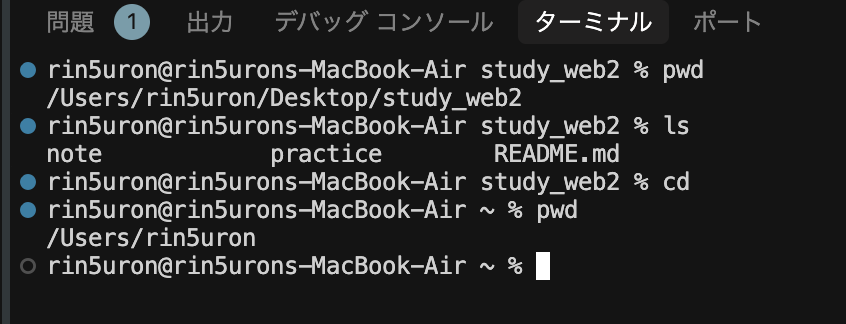
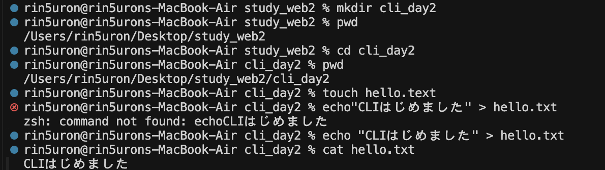
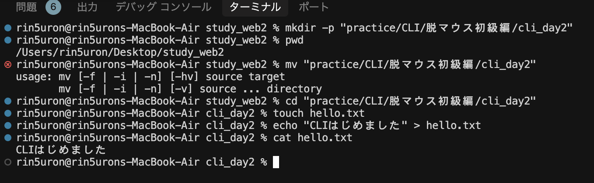
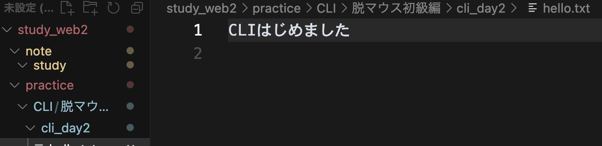
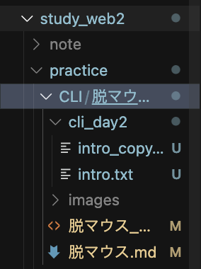
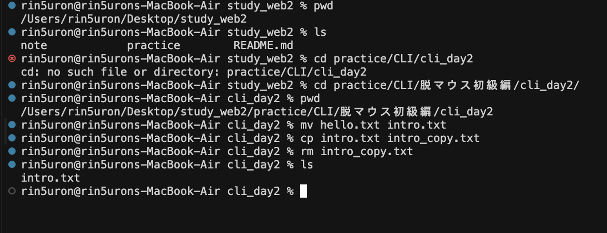
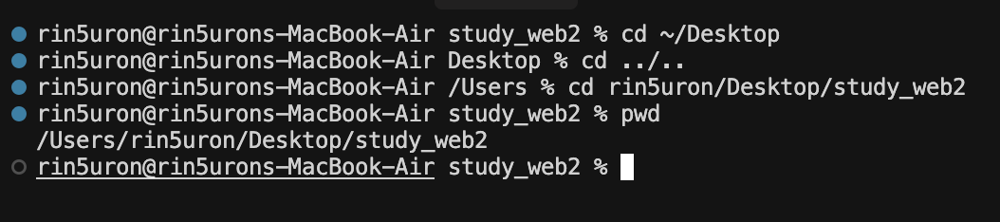
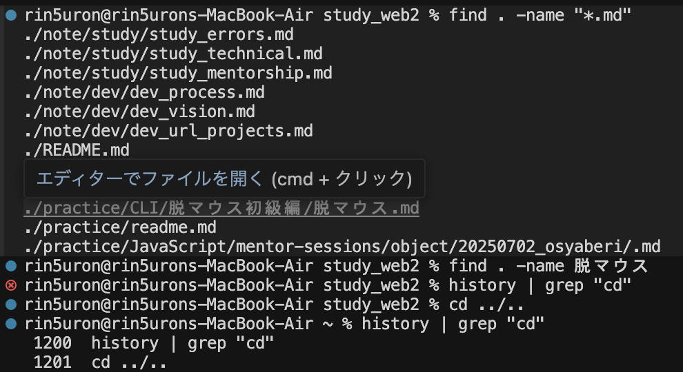
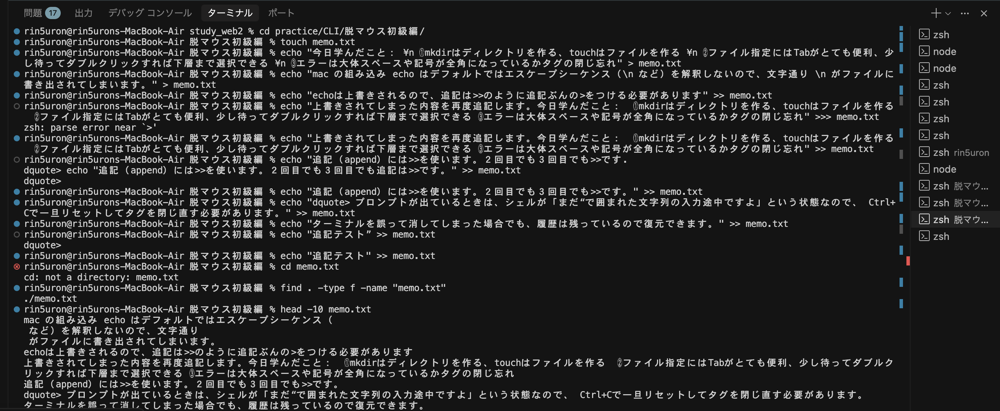
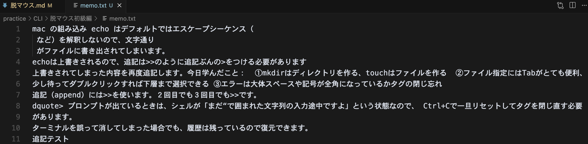

# 💻 脱マウス入門！CLIトレーニング  【初級編】
<small>取得期間：10日間　<br>
演習目安：1日10-15分</small>
---

## 🗓 Day 1：CLIの基本の「き」

### 📌 目標
- ターミナルを開いて、自分の場所（フォルダ）を知ろう
- フォルダの中を見て、移動してみよう

### 🧪 実践コマンドと解説

```bash
pwd
```
- 🔍 **`pwd` = "Print Working Directory"**
- ✅ 今いる場所（パス）を表示する。マウスでいうと「今どのフォルダを見てるか」。

```bash
ls
```
- 🔍 **`ls` = "List"**
- ✅ 現在のフォルダ内にあるファイル・フォルダを一覧表示。

```bash
cd ~/Desktop
```
- 🔍 **`cd` = "Change Directory"**
- ✅ デスクトップ（`~/Desktop`）に移動。`~`はホームディレクトリの省略記号。

```bash
pwd
ls
```
- ✅ デスクトップに移動できたか再確認！

### ✍️ 実践記録

 
<br>

**メモ**: <br>
・bquote> 状態:
入力待ち状態（マルチラインモード）でターミナルが迷子。タグの閉じ忘れやエラー文字の入力等が原因になることがい多い。
bquote> 状態になったら：
Ctrl + C を押してリセット！（一番安全）

<br>
2025/7/26
<br><br><br>

## 🗓 Day 2：ファイルとフォルダを「作る」

### 📌 目標
- フォルダやファイルをコマンドで作れるようになる

### 🧪 実践コマンドと解説

```bash
# リポジトリ直下にディレクトリ作成
mkdir cli_day2
# practice/CLI/cli_day2を作成（親ディレクトリがない場合は同時作成）
mkdir -p "practice/CLI/脱マウス初級編/cli_day2"
```
- 🔍 **`mkdir` = "Make Directory"**
- ✅ 「cli_day2」という名前のフォルダを作成

```bash
# リポジトリ直下の任意ファイルに移動
cd cli_day2
# 任意のディレクトリ内ファイルに移動/日本語を含むパスには必ずクォートを付ける
cd "practice/CLI/脱マウス初級編/cli_day2"

```
- ✅ 作ったフォルダに移動

```bash

```
- 🔍 **`touch` = 空のファイルを作るコマンド**
- ✅ `hello.txt` という空のテキストファイルを作成

```bash
echo "CLIはじめました" > hello.txt
```
- 🔍 **`echo` = 文字列を表示（出力）するコマンド**
- ✅ `>`でファイルに書き込み。上書き保存される。

```bash
cat hello.txt
```
- 🔍 **`cat` = "concatenate"（つなげる）の略**
- ✅ ファイルの中身を表示（読み取り専用）

### ✍️ 実践記録


<div style="display: flex; gap: 10px;">



</div>
<br>

**メモ**: <br>
・コマンドとファイル名の区切り等は半角スペースを空ける<br>
・日本語を含むパスには必ずクォートを付ける<br>
・ルート直下にファイルを置いた後に、同ファイル名で違うディレクトリに作ったらターミナルが混乱してエラー。削除してから実行してもエラー。一度リセットするが吉。紛らわしいことはしない方が吉。<br>
・Ctrl+Cはターミナルの状態はリセットしない<br>

[エラー内容と解決方法]（../../study_errors/## CLI同名ディレクトリ混乱エラー）

<br>
2025/7/27
<br><br><br>

## 🗓 Day 3：ファイルの名前変更・コピー・削除

### 📌 目標
- 基本的なファイル操作をマウスなしで行う

### 🧪 実践コマンドと解説

```bash
mv hello.txt intro.txt
```
- 🔍 **`mv` = "Move"（移動）**
- ✅ ファイル名の変更にも使える。ここではリネーム。

```bash
cp intro.txt intro_copy.txt
```
- 🔍 **`cp` = "Copy"**
- ✅ ファイルをコピーして、複製を作る

```bash
rm intro_copy.txt
```
- 🔍 **`rm` = "Remove"**
- ⚠️ 完全削除。ゴミ箱はなし！慎重に。

```bash
ls
```
- ✅ ファイルがどう変化したか確認

### ✍️ 実践記録

<div style="display: flex; gap: 15px;">


</div>
<br>

**一言メモ**: <br>
・**Tab補完**がとても便利！ファイル名やディレクトリ名の途中まで入力してTabキーを押すと、自動で補完してくれる<br>
・長いファイル名やパスを全部手入力する必要がなくなって、タイピングミスも防げる<br>
・特に日本語を含むパスでは、Tab補完を使うとクォートも自動でつけてくれるので便利<br>
・ファイル操作の基本（mv, cp, rm）をマスターすると、マウスでの右クリックメニューが不要になる<br>

**今日の気づき：**
cdコマンドはフォルダ専用、ファイルの中身を見るときはcatコマンド - コマンドには適材適所がある！

<br>
2025/7/28
<br><br><br>

---

## 🗓 Day 4：パス操作の完全マスター

### 📌 目標
- 絶対パスと相対パスを自由自在に使い分けられるようになる
- フォルダ間の移動で迷わなくなる

### 🧪 実践コマンドと解説

```bash
cd ..
```
- 🔍 **`..` = 1つ上のフォルダ**
- ✅ 1階層上に戻る

```bash
cd ../..
```
- ✅ 2階層上に戻る（`..` を続けて使える）

```bash
cd ~/Desktop
```
- 🔍 **`~` = ホームディレクトリ**
- ✅ デスクトップへ一気に戻る「絶対パス」

```bash
cd "practice/CLI/脱マウス初級編"
```
- ✅ これが「相対パス」。現在地からの距離感で移動する

```bash
pwd
cd ./cli_day2
pwd
```
- 🔍 **`./` = 現在のディレクトリ**
- ✅ 明示的に「今いる場所から」を示す

### 🎯 パス練習問題

1. **問題1**: ホームディレクトリから、一発でDesktopに移動してください
2. **問題2**: 現在地から2つ上の階層に移動してください
3. **問題3**: 絶対パスを使って、study_web2フォルダに移動してください

### ✍️ 実践記録


**一言メモ**: 
・絶対パス（～から始まる）は「住所」、相対パス（..や./）は「道案内」の感覚
・迷ったら `pwd` で現在地確認！

<br>
2025/7/29
<br><br><br>

---

## 🗓 Day 5：ファイル探索＆検索テクニック

### 📌 目標
- マウスでの「ファイル検索」をコマンドで実現
- 大量のファイルから目的のものを素早く見つける

### 🧪 実践コマンドと解説

```bash
find . -name "*.txt"
```
- 🔍 **`find` = ファイル・フォルダ検索**
- ✅ 現在地（.）から、.txtで終わるファイルを全て検索

```bash
find ~ -name "intro*"
```
- ✅ ホームディレクトリから、introで始まるファイルを検索

```bash
ls -la
```
- 🔍 **`ls -la` = 詳細リスト表示**
- ✅ 隠しファイル（.で始まる）も含めて、権限・サイズ・更新日時を表示

```bash
grep "CLI" *.txt
```
- 🔍 **`grep` = テキスト検索**
- ✅ .txtファイルの中から「CLI」という文字を含む行を検索

```bash
history | grep "cd"
```
- 🔍 **`history` = コマンド履歴**
- ✅ 過去に実行したcdコマンドを検索

### 🎯 探索練習問題

1. **問題1**: 現在のディレクトリから、`.md`ファイルを全て見つけてください
2. **問題2**: ファイルの中身に「脱マウス」という文字が含まれるファイルを見つけてください
3. **問題3**: 過去に実行した`mkdir`コマンドの履歴を表示してください

### ✍️ 実践記録

**一言メモ**: 
・find + grep の組み合わせで、マウスの「検索機能」完全再現！

<br>
2025/7/30
<br><br><br>

---

## 🗓 Day 6：テキスト編集の基礎

### 📌 目標
- コマンドラインでファイル編集ができるようになる
- メモ帳感覚でテキスト作成・編集

### 🧪 実践コマンドと解説

```bash
nano sample.txt
```
- 🔍 **`nano` = 初心者向けテキストエディタ**
- ✅ 直感的にファイル編集が可能

**nanoの基本操作**:
- `Ctrl + O`: 保存
- `Ctrl + X`: 終了
- `Ctrl + K`: 行を切り取り
- `Ctrl + U`: 貼り付け

```bash
echo "1行目のテキスト" >> log.txt
echo "2行目のテキスト" >> log.txt
```
- 🔍 **`>>` = 追記モード**
- ✅ ファイルの末尾に内容を追加（上書きしない）

```bash
head -5 log.txt
tail -5 log.txt
```
- 🔍 **`head` = 先頭行表示, `tail` = 末尾行表示**
- ✅ 大きなファイルの一部だけを確認

### 🎯 編集練習問題

1. **問題1**: `memo.txt`ファイルを作成し、今日の感想を3行書いてください
2. **問題2**: 既存ファイルの末尾に「追記テスト」を追加してください
3. **問題3**: 長いファイルの最初の10行だけを表示してください

### ✍️ 実践記録
**スクリーンショット**: 


**一言メモ**: 
・ターミナルの履歴は自動保存されている！

<br>
2025/7/31
<br><br><br>

---

## 🗓 Day 7：脱マウス小技集＋実践演習

### 📌 目標
- 高速操作のためのショートカットをマスター
- 実際の作業シーンで小技を活用


| 操作 | 効果 | 略語の由来 (推測) | 実用度 |
  | :--- | :--- | :--- | :--- |
  | ↑ / ↓ | 入力履歴の呼び出し | (矢印の向き) | ⭐⭐⭐⭐⭐ |
  | Tabキー | コマンド・ファイル名の補完 | (Tabulator key) | ⭐⭐⭐⭐⭐ |
  | Ctrl + C | 実行中のコマンドを止める | Cancel (キャンセル) | ⭐⭐⭐⭐⭐ |
  | Ctrl + L | 画面をクリア（clearと同じ） | Line feed (改頁) | ⭐⭐⭐⭐ |
  | Ctrl + A | カーソルを行頭に移動 | Ahead (先頭) | ⭐⭐⭐⭐ |
  | Ctrl + E | カーソルを行末に移動 | End (末尾) | ⭐⭐⭐⭐ |
  | Ctrl + U | 行全体を削除 | Unix-line-discard | ⭐⭐⭐ |
  | Ctrl + K | カーソル位置から行末まで削除 | Kill (削除) | ⭐⭐⭐ |
  | Ctrl + W | 前の単語を削除 | Word (単語) | ⭐⭐⭐ |
  | Ctrl + R | コマンド履歴から検索 | Reverse-search (逆検索) | ⭐⭐⭐⭐ |


### 🎯 小技実践演習（10問）

**【演習1】履歴活用**
先ほど実行した`ls -la`コマンドを履歴から呼び出して再実行してください
  - ↑ / ↓  で実行OK   

**【演習2】Tab補完マスター**
`practice/CLI/脱マウス初級編/`まで、Tabキーだけで入力してください
 - cd Tabと→で実行OK   
**【演習3】高速画面整理**
ターミナルが情報だらけになったら、一瞬で画面をクリアしてください
　- `Ctrl + L` でクリア。cursor内ではチャットショートカットと干渉した。
**【演習4】間違い修正**
長いコマンドを入力中に、行頭に戻って修正してください
 - `Ctrl + A`でOK、⌘と間違えがち。 
**【演習5】カーソル操作**
コマンド入力中に、行末に一瞬でジャンプしてください
- `Ctrl + E`でOK、⌘と間違えがち。
**【演習6】一括削除**
入力中のコマンド行を全部消去してください
- `Ctrl + U`でOK、⌘と間違えがち。
**【演習7】部分削除**
カーソル位置から行末まで削除してください
- `Ctrl + K`でOK、⌘と間違えがち。
**【演習8】単語削除**
入力中の最後の単語だけを削除してください
- `Ctrl + W`でOK、⌘と間違えがち。
**【演習9】履歴検索**
過去のcdコマンドを検索機能で見つけてください
- `Ctrl + R`でOK、⌘と間違えがち。
**【演習10】コンボ技**
履歴検索→Tab補完→実行を1つの流れで行ってく

**小技習得度チェック**: 
- [◉] 履歴呼び出し（↑↓）
- [⚫︎] Tab補完
- [◉] 画面クリア（Ctrl+L）
- [◉] カーソル移動（Ctrl+A, Ctrl+E）
- [◉] 各種削除技（Ctrl+U, Ctrl+K, Ctrl+W）
- [▲] 履歴検索（Ctrl+R）

**一言メモ**: 
・

<br>
2025/8/14
<br><br><br>

---

## 🗓 Day 8：プロセス管理とシステム情報

### 📌 目標
- 実行中のプログラムを管理できるようになる
- システムの状態を把握する

### 🧪 実践コマンドと解説

```bash
ps aux
```
- 🔍 **`ps` = 実行中のプロセス一覧**
- ✅ 現在動いているプログラムを確認

```bash
top
```
- 🔍 **`top` = リアルタイムシステム監視**
- ✅ CPU使用率、メモリ使用量をリアルタイム表示（qで終了）

```bash
df -h
```
- 🔍 **`df -h` = ディスク使用量表示**
- ✅ ハードディスクの空き容量を確認

```bash
date
cal
```
- ✅ 現在の日時とカレンダー表示

```bash
whoami
```
- ✅ 現在ログインしているユーザー名を表示

### 🎯 システム管理練習

1. **問題1**: 現在実行中のプロセスでCPU使用率が高いものを見つけてください
2. **問題2**: ディスクの使用率を確認してください
3. **問題3**: 自分のユーザー名を確認してください

### ✍️ 実践記録
**スクリーンショット**: 

**一言メモ**: 
・システム管理もマウス不要！コマンドで全て把握可能

<br>
2025/8/2
<br><br><br>

---

## 🗓 Day 9：実践総合演習（シナリオ問題）

### 📌 目標
- 実際の作業シーンを想定した総合問題に挑戦
- 脱マウススキルの総仕上げ

### 🎭 実践シナリオ問題

**🎯 シナリオ1：プロジェクト準備**
新しいプロジェクト「web_project」を作成し、以下の作業をしてください：
1. ホームディレクトリに「web_project」フォルダを作成
2. その中に「html」「css」「js」の3つのサブフォルダを作成
3. htmlフォルダに「index.html」ファイルを作成
4. index.htmlに「Hello, World!」と書き込む
5. 最終的なフォルダ構造を確認

**🎯 シナリオ2：ファイル整理**
現在のディレクトリが散らかっているので整理してください：
1. 全ての.txtファイルを見つける
2. 「backup」フォルダを作成
3. .txtファイルを全てbackupフォルダにコピー
4. 元の.txtファイルは削除
5. 作業結果を確認

**🎯 シナリオ3：ログ調査**
システムの問題を調査してください：
1. 現在実行中のプロセスを確認
2. ディスク使用量をチェック
3. 過去に実行したコマンド履歴から、問題がありそうなコマンドを探す
4. 調査結果をreport.txtにまとめる

**🎯 シナリオ4：緊急対応**
間違って重要なファイルを変更してしまいました：
1. バックアップからファイルを復元
2. 変更履歴を確認
3. 再発防止のためのメモをcaution.txtに作成
4. 今後気をつけるポイントを記載

### 📊 評価チェックリスト

- [ ] マウスを一切使わずに作業完了
- [ ] Tab補完を効果的に活用
- [ ] ショートカットキーを5種類以上使用
- [ ] エラーが発生した際、自力で解決
- [ ] 作業時間：各シナリオ10分以内

### ✍️ 実践記録
**完了シナリオ**: 
- [ ] シナリオ1
- [ ] シナリオ2  
- [ ] シナリオ3
- [ ] シナリオ4

**一言メモ**: 
・

<br>
2025/8/3
<br><br><br>

---

## 🗓 Day 10：最終チャレンジ（完全脱マウス認定試験）

### 📌 目標
- ドラッグ&ドロップ以外の全操作をマウスなしで実行
- 脱マウスマスター認定を獲得！

### 🏆 最終認定試験

**制限時間：30分**
**条件：マウス・トラックパッド使用禁止**

### 🎯 認定課題

**課題1：環境構築（5分）**
```
project_final/
├── src/
│   ├── components/
│   └── utils/
├── tests/
├── docs/
└── README.md
```
この構造のプロジェクトを作成し、README.mdに「脱マウス達成！」と記載

**課題2：ファイル操作（10分）**
1. 5つのテストファイル（test1.txt〜test5.txt）を作成
2. 各ファイルに異なる内容を書き込み
3. test3.txtをtest3_backup.txtにコピー
4. test4.txtとtest5.txtを削除
5. 残ったファイルをbackupフォルダに移動

**課題3：情報収集（10分）**
1. システムの現在時刻を確認
2. ディスク使用量を調査
3. 実行中プロセスの中で最もCPUを使用しているものを特定
4. 今日実行した全コマンドの履歴をcommand_log.txtに保存

**課題4：総合実践（5分）**
1. 作業ディレクトリを任意の場所に変更
2. 隠しファイルも含めて全ファイルをリスト表示
3. 特定の文字列を含むファイルを検索
4. 最終的な成果をfinal_report.txtにまとめ

### 🏅 認定基準

**🥇 脱マウスマスター（90点以上）**
- 全課題を制限時間内に完了
- ショートカットキーを自然に使用
- エラー発生時も冷静に対処

**🥈 脱マウス上級者（75点以上）**
- 8割以上の課題を完了
- 基本操作は完全習得

**🥉 脱マウス中級者（60点以上）**
- 6割以上の課題を完了
- 基本的なファイル操作は可能

### ✍️ 最終記録

**達成課題**: 
- [ ] 課題1：環境構築
- [ ] 課題2：ファイル操作
- [ ] 課題3：情報収集
- [ ] 課題4：総合実践

**認定レベル**: 

**学習の振り返り**: 
・

**今後の目標**: 
・

<br>
2025/8/4
<br><br><br>

---

## 🎉 おめでとうございます！

これであなたは**完全脱マウス**を達成しました！🎊

### 🎯 習得したスキル

✅ **基本操作**: pwd, ls, cd, mkdir, touch, cat  
✅ **ファイル操作**: mv, cp, rm, nano  
✅ **探索・検索**: find, grep, history  
✅ **システム管理**: ps, top, df  
✅ **効率化**: Tab補完、履歴活用、ショートカット  

### 🚀 次のステップ

- **中級編**: Git操作、SSH接続、shell scripting
- **上級編**: vim mastery、正規表現、system administration
- **実践編**: 実際の開発プロジェクトでの脱マウス活用

---

**あなたは今、キーボードだけで自由自在にコンピュータを操る強いエンジニアです！** 💪✨
