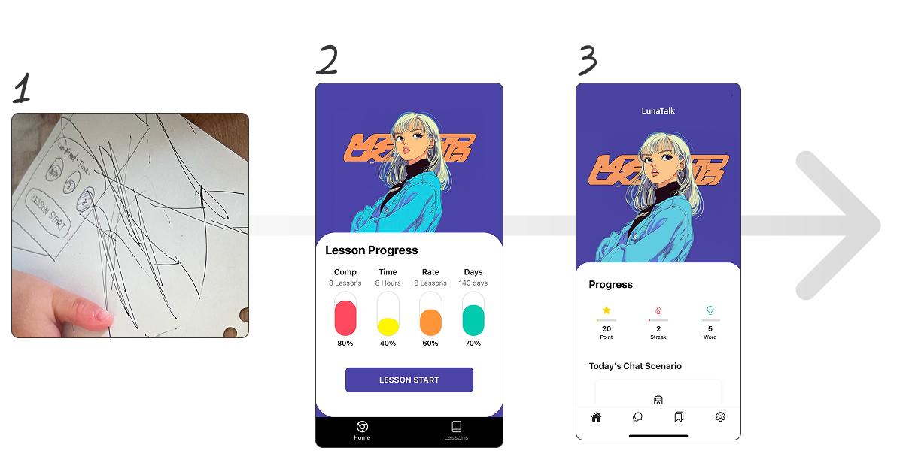

# 刺さるUI・UXの作り方
　2025/08/05
## UI/UXを考える時に大切にしていること

- ユーザーの目を止める　
  - 目を引く要素を作る
  - 他の要素はそれを引き立てるようにする　

　- 
- GoogleやAppStoreで引っ掛かるようにする
- オンボーディング
  - 新規ユーザーが初めてプロダクトを使うときの理解から操作までの導線

- 参考
  - ８の倍数ルールでデザインする
https://yuyakinoshita.com/blog/2019/02/10/design-by-multiple-of-8/

 

## UI/UXはセンスじゃない

- https://izanami.dev/post/8299caf9-2b93-467a-85a3-b178413c8719/opengraph-image-1umokf?5589478d64c13f8a=
- UI/UX：ユーザーが迷わず使えるために突き詰めた設計
 - 白黒の文字であっても、余白や配置でUIやUXは生まれる
- 自分のデザインを見るときの視点で意識していること
  - ぼーっと引きで見たときに、一番目が行くところを重点的に直してみる
- 個人開発プロダクトでよくある問題
  - ボタンが分かりやすいところにない
   - 次なにやればいのか分からないところが多い